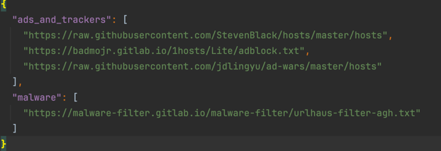
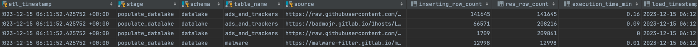
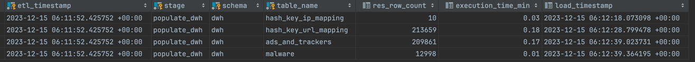
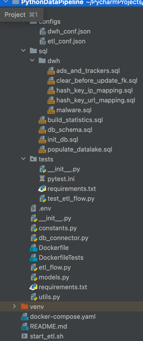
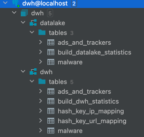

# Python Data Pipeline Project

## Overview
The Python Data Pipeline is a project designed for managing and processing data using various technologies including Python, Docker, and PostgreSQL.
As the project based on local machine were chosen use Python for manage processing, Docker (docker-compose) for managing ETL, and Postgres DB as a storage BD.

**_Sources:_**
- various URL placed in ./configs/etl_conf.json.



**_Destination:_**
- Postgres DB run by docker container.

Entry point of project: `etl_flow.py`: initialize DB schemas, populate Datalake, and DWH. Loading process organised in batch(+ incremental) population of DataLake, 
and incremental population of DWH. It gives goode scalability of the solution. 
Also, the solution includes process of building **_Statistics_** of populating DataLake and DWH.
Based on python decorator and populate tables:
- DataLake - `build_datalake_statistics`:



- DWH - `build_dwh_statistics`:




Populating statistics can be used for creating additional data validation checks and creating Alert based on it. 
Like Alert notification can be used Slack and email (the last one for critical Alerts).


## Project Structure



- `etl` - Scripts for ETL (Extract, Transform, Load) processes. Includes following:
  * `configs` - managing loading process. Includes:
    * `etl_conf.json` - using for datalake populating. Loading from URL to separate Postgres schema like datalake.
    *  `dwh_conf.json` - using for dwh populating. Separate schema in Postgres DB.
  * `sql` - SQL scripts for database initialization, managing schemas, populate DataLake, and DWH.
  * `tests` - Tests of each class(class method) and function in ETL flow using Mock approach where needed. Tests run before the main ETL flow in separate Docker container like separate Service with own infrastructure (Dockerfile, requirements.txt)
  * `.env` - Env variable for managing creation DB and connection to BD. Better to use more secure way like using AWS Secret Manager for that. Thus is just for MVP version.
  * `constants.py` - Source of all setting constants.
  * `db_connector.py` - Managing DB connections.
  * `Dockerfile` - Dockerfile for running ETL Flow.
  * `DockerfileTests` - Dockerfile for running Tests.
  * `etl_flow.py` - Entry point of project. Run ETL and all dependencies.
  * `models.py` - Handling populating Schema of datalake with validation of populating input data. Alternative for AWS Glue Catalog. 
  * `requirements.txt` - ETL flow dependencies.
  * `utils.py` - utilities for loading process.
- `docker-compose.yaml` - ETL flow and managing full loading process.
- `start_etl.sh` - Runnable script to run full process and check needed dependencies.

## DB Structure:



- `datalake` - schema - contents Datalake Data from sources (URL). Includes:
  - `ads_and_trackers` - table with Ads and Trackers data
  - `malware` - table with Malware data
  - `build_datalake_statistics` - statistics of loading datalake process.
- `dwh` - schema for DWH result data. Includes:
  - `hash_key_ip_mapping` - mapping table with hash_key for each ip.
  - `hash_key_url_mapping` - mapping table with hash_key for each url.
  - `ads_and_trackers` - normalized ads_and_trackers datalake table.
  - `malware` - normalized malware datalake table.
  - `build_dwh_statistics` - statistics of loading dwh process.


## Usage
For run this ETL need to do:
1. Install Docker.
2. Go to project folder.
3. Make `start_etl.sh` runnable:
```
chmod +x start_etl.sh
```
4. Run `start_etl.sh`:
```
./start_etl.sh
```
5. Clearing containers:
```
docker-compose down
```
